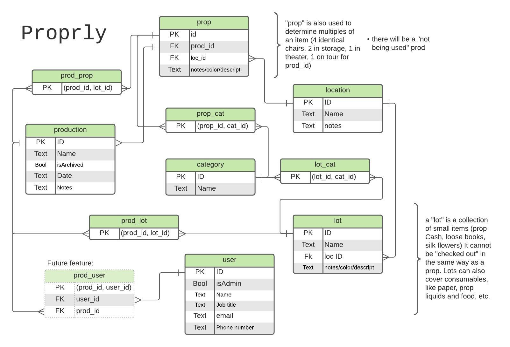

# Proprly
## The right tool for theaters and production managers
#### 1. What tech stack will you use for your final project? 
- **Proprly** uses a Node.js API, and a PostgreSQL Database. The frontend will use React.  
#### 2. Is the front-end UI or the back-end going to be the focus of your project? Or are you going to make an evenly focused full-stack application?
  - In its initial stages, **Proprly** will be more backend focused, as the UI is intended to be very simple and easy to use, but in future iterations and features, it wil become a more balanced full-stack application
#### 3. Will this be a website? A mobile app? Something else?
 - The first step will be a Web app (with mobile design), and eventually will add a mobile app. 
#### 4. What goal will your project be designed to achieve?
   - The goal of **Proprly** is to facilitate organization of theatrical props as well as storage. Current organizational systems are either not designed for this purpose, are too expensive, are hard to maintain, or are analog and are difficult to search quickly. This will futher enable the planning of productions remotely, as well as enable a quick printout of a show's prop list for travelling productions, cutting down man hours.
   - The Admin users are able to determine their own organization system using Location and Categories.
#### 5. What kind of users will visit your app? In other words, what is the demographic of your users?
   -  **Proprly** is marketed towards theaters and theater companies who want to implement a prop and storage managment system that is accessible off-site and isnt a 7k row excel spreadsheet. 
#### 6. What data do you plan on using? How are you planning on collecting your data?
   - **Proprly** relies on user generated data from a form. Eventually allowing users to input CSV to be formatted and inserted into the DB.
#### 7. In brief, outline your approach to creating your project (knowing that you may not know everything in advance and that these details might change later). Answer questions like the ones below, but feel free to add more information:

   1. What does your database schema look like?
    
    Version 2, simplifying the relationship b/w "lot" and "prop"
    

   2. What kinds of issues might you run into with your API? This is especially important if you are creating your own API, web scraping produces notoriously messy data.
       - The primary concern is organizing how professionals think of props: Is a collection of small items in the database as a collection, or considered as many individual items? How do we deal with color, which is extremely subjective, but a necessarily searchable aspect of an item. Data Validation will be extremely important.
       - For now props are only connected to a Production when they are being used, but in the future having an archive of props per Production would be helpful.
   3. Is there any sensitive information you need to secure?
      - In the future there will be contact information for directors and designers they might not want shared.
      - Eventually price of props for invoicing would be included, and financial information should be secured.
   4. What functionality will your app include?
      -  Users will be able to create, as well as search through props, attatching them to active Productions. Admin will be able to add categories and locations for prop organization and searching, as well as edit and delete props, and add/edit/delete productions.
   5. What will the user flow look like?
   <!--https://lucid.app/lucidchart/f3e86a66-984e-4bbb-9ebd-3b73f8d68750/edit?beaconFlowId=7D70C9FBCD5CA0C9&page=0_0# -->

  
  
   6. What features make your site more than a CRUD app? What are your stretch goals?
      - For the meanwhile it is mostly a CRUD app, with a very specific real world application. Eventually it could be used for communication and planning, perhaps even an inter-theater regional prop Library system.
      - Eventually users could be assigned to productions by admin, and would only be able to see/edit/add to productions they are involved in. 
      - Another stretch goal would be to create private User lists of props for the purpose of real world organization or planning.