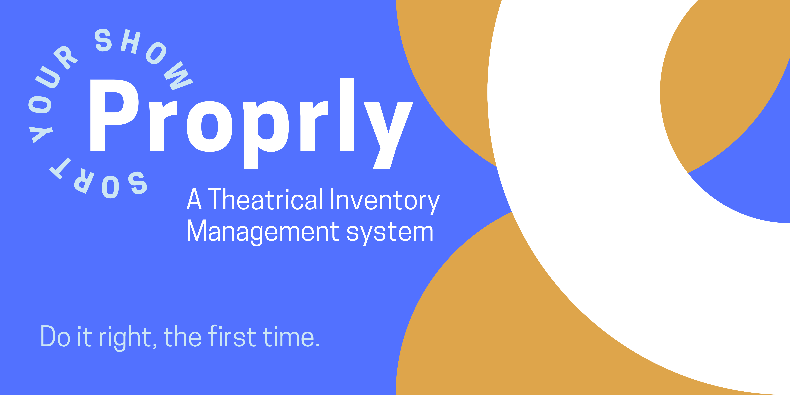

[](https://www.proprly.app)
[](https://app.netlify.com/sites/happy-lamarr-68154f/deploys)

# Introduction (V.0)

Hi there! 

**Proprly** ([https://www.proprly.app](https://www.proprly.app)) is a web app designed to help theaters manage the age old question: 

> Where the heck did that thing go from that show we did (however many) years ago???

Instead of relying on hundreds of binders full of prop lists, that one carpenter who has been there since the 60s, and mammoth Excel spreadsheets, Proprly can help keep everyone on the same page.

We are currently in Version 0, so if you are a theater and want to help test things out, [contact us](mailto:proprlyapp@google.com)!

### Near future updates:
- Items will have images (CDN hosted for speed)
- Better search functionality
- Incorporating Tagging items into the frontend for more in-depth organization/easier searching
- Admin users will be able to add user and other admin accounts on the frontend
- Batch adding of items using CSV
- Faster hosting

# How to use Proprly V0:
**Keep in mind that V0 is to experience the application and is public. Those with a login can see all of the information! If you are interested in being part of our beta, [contact us!](mailto:proprlyapp@google.com)**
+ Go ahead and sign up or sign in!
+ Go to the Location tab to add/manage locations
  + Think about how you currently organize things... is it by room? by aisle?
  + Locations can also be less literal
    + For food items that need to be made or purchased the day before:
      + Grocery Store 
      + Name of local Bakery
    + For items that dont have a permanent home yet
      + Need to be organized
      + Unsorted
  + Make nested locations to reflect your unique system.
  + When looking at a location, the items listed will reflect all of the items in that location as well as its sublocations.
+ Go to the Production tab to add and manage productions.
  + Add active productions, things you are currently working on.
  + Add notes with cast, production team, important details.
+ Go to Items tab to add and manage items.
  + Add items into the location system you have devised.
  + If an item is a consumable or bulk item (Edible items, Florals, smaller trinkets, generic books) we recommend you do not set the quantity as it may not be helpful to keep track of each individual item.
  + We have separated the concept of items and props to make it easier to count items. 
    + For example, in the case of a consumable like a newspaper that gets crumpled in a show, its not important to count the number of newspapers in a warehouse.
    + it might be valuable to know that this show requires 2 newspapers per show.
    + Therefore the item "Newspaper" might not have a quantity, but the prop of that item in a production can have its own notes("One gets crumpled and tossed into the audience") and quantity of 2.
+ The Home icon on the navigation bar will take you to the Props management dashboard.
  + The tab bar on this page has all of your productions listed.
  + Under each tab you can click on any of the items in the list on the left to add them as props to this production. 
  + The notes and quantity of the props can be edited on this page as well.
  
# Development Info

## Frontend:
- [React](https://github.com/facebook/react), [Create-React-App](https://github.com/facebook/create-react-app), [React Router](https://github.com/remix-run/react-router), [React Window](https://github.com/bvaughn/react-window), and [MaterialUI](https://github.com/mui-org/material-ui)
- hosted on [Netlify](https://www.netlify.com)


## Backend: 
- [Express](https://github.com/expressjs/express), [Node.js](https://github.com/nodejs/node), [PostgreSQL](https://github.com/postgres/postgres), and [JSON Schema](https://github.com/json-schema-org)
- API Deployed with [Heroku](https://www.heroku.com)
- In `/backend` run `npm test` (proprly_test db needed)


# API 

### Located at : [https://proprly.herokuapp.com/](https://proprly.herokuapp.com/)

---

## Authentication
Proprly API uses Json web token for all resources. 

After registering or logging in, a token will be returned. That token can be used in your JSON request headers for all requests.
```json
{"Authorization": "Bearer YOURTOKENHERE"} 
```
## Registration 
+ ### POST /auth/register
  + Register a new account
  + Parameter
  + Example: 
    + Request Body:
    ```json
    {"username": "exampleUser", 
    "password":"MyPassword123", 
    "firstName": "First", 
    "lastName": "Last", 
    "email":"email@gmail.com" }
    ```
    + Response:
    ```json
    {"username":"exampleUser",
    "token":"EXAMPLETOKEN"}
    ```
+ ### POST /auth/token
  + Login to an existing account
  + Example:
    + Request Body:
    ```json
    {"username":"exampleUser", 
    "password":"MyPassword123"}
    ```
    + Response:
    ```json
    {"username":"exampleUser",
    "token":"EXAMPLETOKEN"}
    ```
## Users 
  + ### POST /users
    + Creates a new user. This is not the registration endpoint that the frontend uses. 
    + This is only for admin users to add new users. The new user being added can be an admin. 
    + This returns the newly created user and an authentication token for them:
    + Example:
        Request Body:
        ```json
        {
        "username": "exampleAdmin", 
        "password":"MyAdminPassword", 
        "firstName": "First", 
        "lastName": "Last", 
        "email":"email@gmail.com",
        "phone":null,
        "isAdmin":true
        }
        ```
        Response:
        ```json
        "user": {
            "username": "exampleAdmin",
            "firstName": "First",
            "lastName": "Last",
            "email": "email@gmail.com",
            "isAdmin": true
        },
        "token": "EXAMPLETOKEN"
        ```
  + ### GET /users
    + Admin only
    + Read a list of all users
    + Example Response:
        ```json
        "users": [
            {
            "username": "exampleAdmin",
            "firstName": "First",
            "lastName": "Last",
            "email": "email@gmail.com",
            "phone": null,
            "isAdmin": true
            },
            {
            "username": "testuser",
            "firstName": "Test",
            "lastName": "User",
            "email": "joel@joelburton.com",
            "phone": "18001234567",
            "isAdmin": false
            },
            ...
        ]
        ```
  + ### GET /users/{username}
    + Admin or same user only
    + Read details on a user by username
    + Example Response:
        ```json
        "user": {
            "username": "testuser",
            "firstName": "Test",
            "lastName": "User",
            "email": "joel@joelburton.com",
            "phone": "18001234567",
            "isAdmin": false
        }
        ```
  + ### PATCH /users/{username} 
    + Admin or same user only
    + Update user by username
    + Data can include:
  `{ firstName, lastName, password, email }`
    + Example:
        Request Body:
        ```json
        {
            "firstName": "Testing",
            "email": "joel@joelburton.com",
            "phone": "19001234567",
        }
        ```
        Response:
        ```json
         "user": {
            "username": "testuser",
            "firstName": "Testing",
            "lastName": "User",
            "email": "joel@joelburton.com",
            "phone": "19001234567",
            "isAdmin": false
        }
        ```
  + ### DELETE /users/{username}
    + Admin or same user only
    + Delete a user by username
    + Returns username of deleted user
    + Example response:
        ```json
        {
            "deleted": "testuser"
        }
        ```
## Locations 
  + ### POST /locations
    + Create new location
    + Example:
        Request Body:
        ```json
        {"name":"locName", 
        "notes":"notes about the location",
        "parentId":null}
        ```
        Response:
        ```json
        "location":{
            "id":4,
            "name":"locName", 
            "notes":"notes about the location",
            "parentId":null
        }
        ```
  + ### GET /locations
    + Read all locations nested in parent/child hierarchy
    + Example Response:
        ```json
        "locations": [
            {
            "parentId": null,
            "locationId": 2,
            "locationName": "Opera Center",
            "children": [
                {
                "parentId": 2,
                "locationId": 8,
                "locationName": "Theater A"
                },
                {
                "parentId": 2,
                "locationId": 9,
                "locationName": "Theater B"
                }
            ]
            },
            {
            "parentId": null,
            "locationId": 3,
            "locationName": "rehearsal studios"
            }
        ```
  + ### GET /locations/list
    + Read all locations in a flat, non-nested list
    + Example Response:
        ```json
        "locations": [
            {
            "parentId": 5,
            "locationId": 12,
            "locationName": "Bay 1"
            },
            {
            "parentId": 10,
            "locationId": 13,
            "locationName": "Bay 2"
            },
            {
            "parentId": 1,
            "locationId": 4,
            "locationName": "Bay 3"
            },
        ```
  + ### GET /locations/{id}
    + Read a single location detail (including items listed at that location)
    + Example Response:
        ```json
        "location": {
            "id": 3,
            "name": "rehearsal studios",
            "notes": "567 main st.",
            "parentId": null,
            "items": [
            {
                "id": 14,
                "name": "Quills",
                "quantity": null,
                "description": "Qui quis occaecat sunt laborum. Laborum dolore elit ad quis dolore consectetur. Nisi commodo adipisicing exercitation reprehenderit nulla cillum.",
                "price": null,
                "loc_id": 3,
                "location": "rehearsal studios"
            }
            ]
        }
        ```
  + ### PATCH /locations/{id}
    + Update a location information by id
    + Example:
  
        Request Body:

        ```json
        {"name":"ChangedlocName", 
        "parentId":1}
        ```

        Response:

        ```json
        "location":
            {"name":"ChangedlocName", 
            "notes":"notes about the location",
            "parentId":1}
        ```
  + ### DELETE /locations/{id}
    >#### **Warning:** 
    >**THIS WILL DELETE ALL NESTED LOCATIONS OF THE DELETED LOCATION AS WELL AS ITEMS IN THEM**
    + Admin Only
    + Delete a location by id
    + Returns id of deleted location
    + Example response:
        ```json
        "deleted": 3
        ```
## Lots
  + ### POST /lots
    + Create new Lot
    + Example:
        Request Body:
        ```json
        {"name":"New Item", 
        "locId":2,
        "quantity":2,
        "price":null,
        "description
        }
        ```
        Response:
        ```json
        "lot":
            {
            "id":4,
            "name":"New Item", 
            "locId":2,
            "quantity":2,
            "price":null,
            "description":"a stack of fake books"
            }
        ```
  + ### GET /lots
    + Read a list of all items
    + Example Response:
        ```json
        "lots": [
            {
            "id": 1,
            "name": "paper",
            "locId": 5,
            "location": "Bay 4",
            "quantity": null,
            "available": null,
            "price": null,
            "tags": [],
            "description": "Loose paper sheets"
            },
            {
            "id": 2,
            "name": "laptop",
            "locId": 2,
            "location": "Opera Center",
            "quantity": 1,
            "available": null,
            "price": null,
            "tags": [
                "Set Dressing",
                "Hand Props"
            ],
            "description": "an old windows laptop"
            },
            ...
            ]
        ```
  + ### GET /lots/{id}
    + Read details on a single item by id
    + Example Response:
        ```json
        "lot": {
            "id": 5,
            "name": "Table",
            "locId": 10,
            "quantity": 2,
            "available": null,
            "price": "$9.95",
            "description": "Maecenas tincidunt lacus at velit. Vivamus vel nulla eget eros elementum pellentesque. Quisque porta volutpat erat. Quisque erat eros, viverra eget, congue eget, semper rutrum, nulla.",
            "location": "Bay 5.",
            "tags": [
            "Set Dressing"
            ],
            "active": [
            {
                "id": 16,
                "title": "Die Fledermaus",
                "quantity": null,
                "notes": null
            },
            {
                "id": 8,
                "title": "Lulu",
                "quantity": null,
                "notes": null
            },
            {
                "id": 7,
                "title": "Cendrillon",
                "quantity": null,
                "notes": null
            }
            ]
        }
        ```
  + ### PATCH /lots/{id} 
    + Update Item by id
    + Example:
        Request Body:
        ```json
        {"name":"New Item", 
        "locId":5,
        "price":"10.25",

        }
        ```
        Response:
        ```json
        "lot":
            {"name":"New Item", 
            "locId":5,
            "quantity":2,
            "price":"10.25",
            "description":"a stack of fake books"
            }
        ```
  + ### DELETE /locations/{id}
    + Admin Only
    + Delete a location by id
    + Returns id of deleted location
    + Example response:
        ```json
        "deleted": 5
        ```
## Productions
  + ### POST /productions
    + Create new production
    + Example:
  
        Request Body:

        ```json
        {
        "title": "Prod Name",
        "dateStart": "2002-11-20T00:00:00.000Z",
        "dateEnd": "2021-09-25T00:00:00.000Z",
        "active": false,
        "notes": "notes"
        }
        ```
        Response:

        ```json
        "production": {
            "id": 2,
            "title": "Prod Name",
            "dateStart": "2002-11-20T00:00:00.000Z",
            "dateEnd": "2021-09-25T00:00:00.000Z",
            "active": false,
            "notes": "notes",
        }
        ```
  + ### GET /productions
    + Read a list of all items
    + Example Response:
        ```json
        "productions": [
            {
            "id": 16,
            "title": "Die Fledermaus",
            "dateStart": "2012-05-15T00:00:00.000Z",
            "dateEnd": "2020-07-26T00:00:00.000Z",
            "active": true,
            "notes": "cum sociis natoque penatibus..."
            },
            {
            "id": 15,
            "title": "Il barbiere di Siviglia",
            "dateStart": "2001-10-10T00:00:00.000Z",
            "dateEnd": "2021-08-17T00:00:00.000Z",
            "active": true,
            "notes": "amet erat nulla tempus vivamus..."
            },
            ...
            ]
        ```
  + ### GET /productions/{id}
    + Read details on a single production by id
    + Example Response:
        ```json
        "production": {
            "id": 4,
            "title": "Die Entfuhrung aus dem Serail",
            "dateStart": "2009-02-21T00:00:00.000Z",
            "dateEnd": "2020-09-25T00:00:00.000Z",
            "active": false,
            "notes": "proin leo odio porttitor id consequat in consequat ut nulla sed accumsan felis ut at dolor quis odio consequat varius integer ac leo pellentesque ultrices mattis odio",
            "props": [
            {
                "id": 7,
                "name": "Books",
                "quantity": null,
                "notes": null
            },
            {
                "id": 15,
                "name": "Silk florals, Pink",
                "quantity": 7,
                "notes": null
            }
            ]
        }
        ```
  + ### PATCH /productions/{id} 
    + Update production by id
    + Example:
        Request Body:
        ```json
        {"title":"New Prod Name", 
        "active":true,
        "notes":"updated notes"
        }
        ```
        Response:
        ```json
        "production": {
            "id": 2,
            "title": "New Prod Name",
            "dateStart": "2002-11-20T00:00:00.000Z",
            "dateEnd": "2021-09-25T00:00:00.000Z",
            "active": true,
            "notes": "updated notes"
            }
        ```
  + ### DELETE /productions/{id}
    + Admin Only
    + Delete a production by id
    + Returns id of deleted production
    + Example response:
        ```json
        "deleted": 5
        ```
## Props
  + ### POST /props
    + Create new production
    + Example:
        Request Body:

        ```json
        {
            "prodId": 2,
            "lotId": 4,
            "quantity": null,
            "notes": null
        }
        ```
        Response:
        ```json
        "prop": {
            "prodId": 2,
            "lotId": 4,
            "quantity": null,
            "notes": null
        }
        ```
  + ### PATCH /props/{prodId}/{lotId} 
    + Update prop by production id and lot id
    + Example:
        Request Body:
        ```json
        {"quantity": 3}
        ```
        Response:
        ```json
        "prop": {
            "prodId": 3,
            "lotId": 4,
            "quantity": 3,
            "notes": null
        }
        ```
  + ### DELETE /props/{prodId}/{lotId}
    + Admin Only
    + Delete a prop by production id and lot id
    + Returns id of deleted production and lot
    + Example response:
        ```json
        "deleted": {
            "lotId": 14,
            "prodId": 1
        }
        ```
## Tags
  + ### POST /tags
    + Create new tag
    + Example:
        Request Body:
        ```json
        {"title" : "Blue"}
        ```
        Response:
        ```json
        "tag": {
            "id": 7,
            "title": "Blue"
        }
        ```
  + ### POST /tags/lots/:lotId
    + Create new production
    + Example:
        Request Body:
        ```json
        {"title": "Furniture"}
        ```
        Response:
        ```json
        "tag": {
            "lotId": 2,
            "lotName": "Antique Chair",
            "tagId": 7,
            "tagTitle": "Furniture"
        }
        ```
  + ### GET /tags
    + Read a list of all tags, including a count of the lots with that tag
    + Example Response:
        ```json
        "tags": [
            {
            "id": 1,
            "title": "Set Dressing",
            "lotsWithTag": "9"
            },
            {
            "id": 3,
            "title": "Set Props",
            "lotsWithTag": "0"
            },
            {
            "id": 4,
            "title": "Greens",
            "lotsWithTag": "1"
            },
            ...
        ]
        ```
  + ### GET /tags/{id}
    + Read a tag by id
    + Example Response:
        ```json
        "tag": {
            "id": 2,
            "title": "Hand Props",
            "lots": [
            {
                "id": 3,
                "name": "Rotary phone",
                "description": "red rotary phone",
                "locId": 4,
                "location": "Bay 3"
            },
            ...
            ]
        }
        ```
  + ### PATCH /tags/{id} 
    + Update tag by id
    + Example:
        Request Body:
        ```json
        {"title": "Corrected Spelling"}
        ```
        Response:
        ```json
        "tag": {
            "id": 7,
            "title": "Corrected Spelling"
        }
        ```
  + ### DELETE /tags/{id}
    + Admin Only
    + Delete a tag
    + Returns id of deleted tag
    + Example response:
  + ### DELETE /tags/lots/{tagId}/{lotId}
    + Admin Only
    + Delete a tag/lot connection
    + Returns id of deleted tag and lot
    + Example response:
        ```json
        "deleted": {
            "lotId": 2,
            "tagId": 1
        }
        ```
